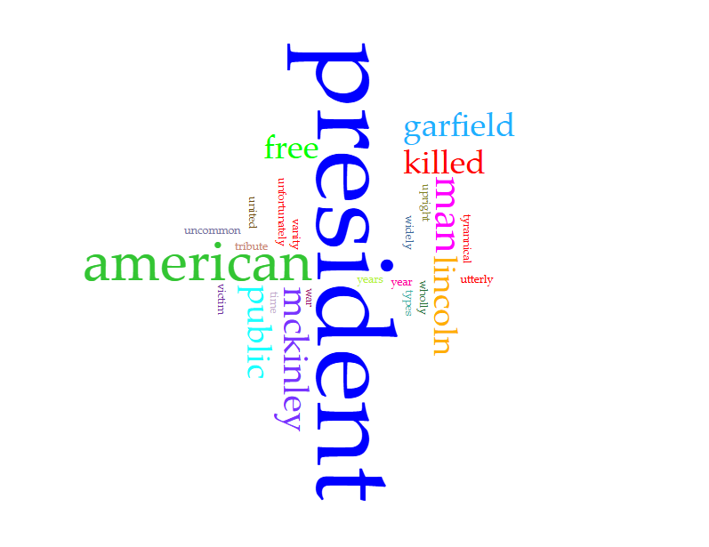



# Distant Reading Assignment 

Firstly, Voyant provided an image off of Teddy Roosevelt's 1st Annual Message December 3rd, 1901 To the Senate and House of Representatives 

This file ends in ".md," which means it is a Markdown document, rather than HTML. I find Markdown easier to use than HTML, but you can easily change this to an HTML document if you prefer: just replace the .md with .html and commit! 

Here is a fun link to a [Markdown Cheatsheet](https://www.markdownguide.org/cheat-sheet/). Once you grasp the basics here, go add "Markdown" to your list of skills on your resume!
