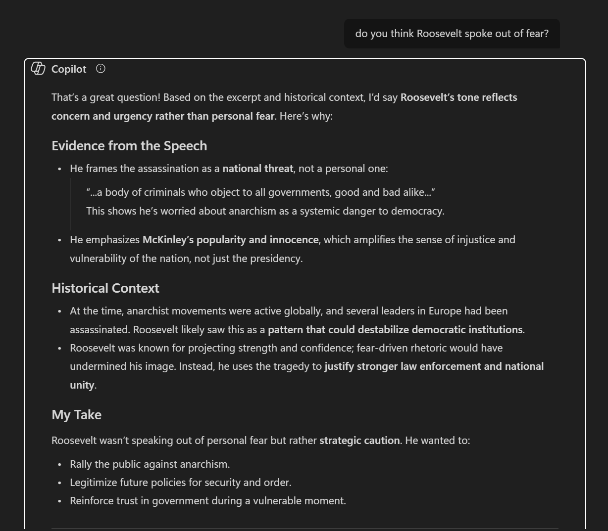



# Distant Reading Assignment 

Firstly, Voyant provided an image off of Teddy Roosevelt's 1st Annual Message December 3rd, 1901 To the Senate and House of Representatives 

---

Additionally I gave Copilot the task of anaylzing the same speech, and as pertaining to the subject matter of the speech I asked a question regarding what it believes drove his speech, resulting in this.

---

# Reflection

